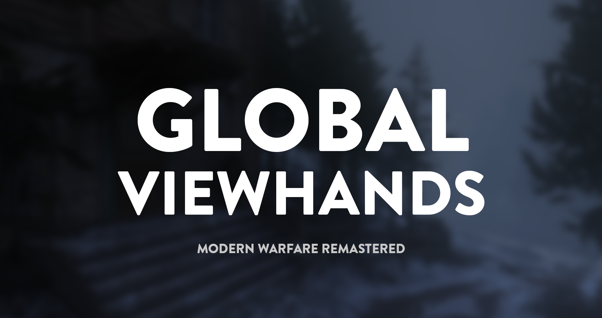
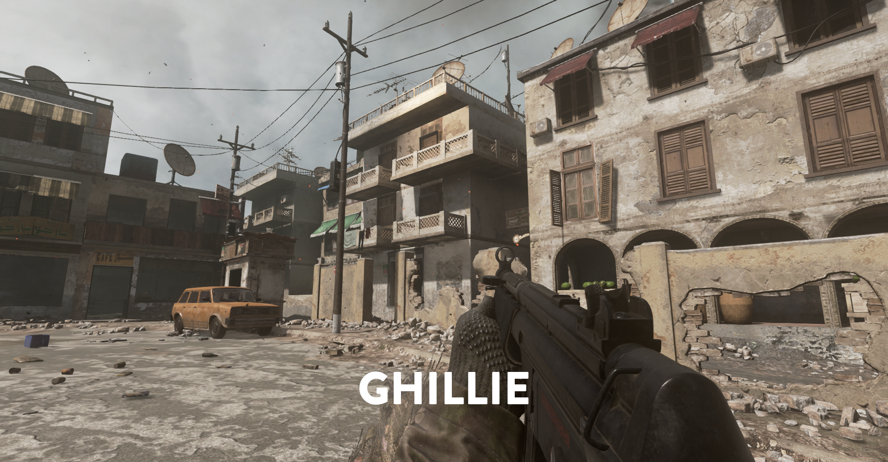
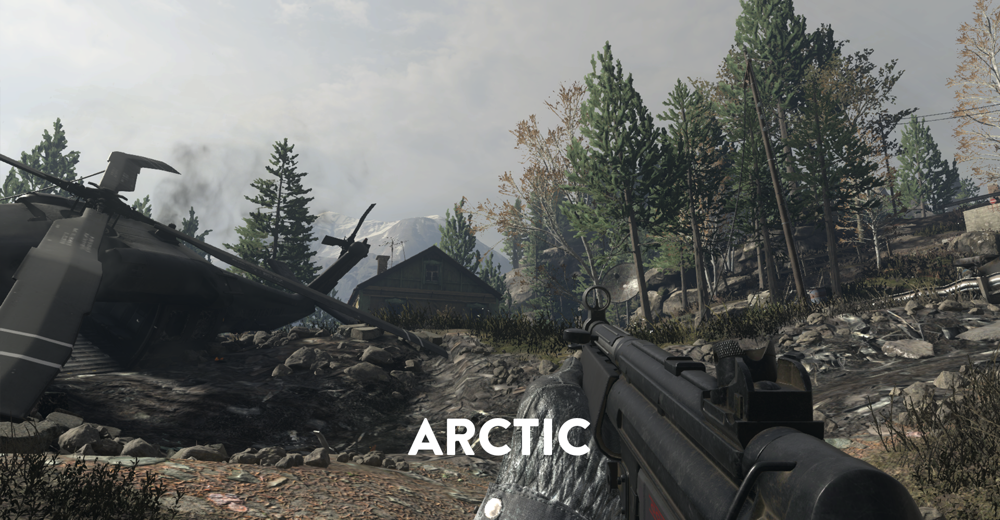
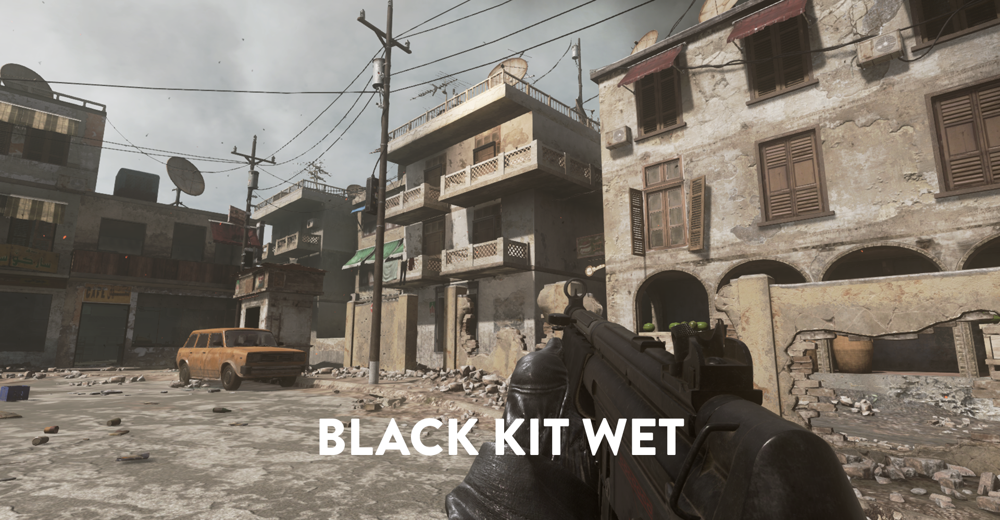

     
    
     
     
    
A mod for Modern Warfare Remastered that allows you to use any viewhand, anywhere.

    

        
NOT YET RELEASED

    

# Features

-   Easy to use interface
-   Global viewhands for all maps
-   Individual viewhands for certain maps
-   Viewhands list
    -   Marines
    -   Woodland
    -   Black Kit
    -   Black Kit Wet
    -   Ghillie
    -   Spetsnaz
    -   Spetsnaz Wet
    -   OpFor
    -   OpFor Full Sleeve
    -   Arctic

# Installation

1. Prepare a copy of MWR. Read the [H1-Mod Manual](https://docs.h1.gg/install) for more information.

2. Install [H1-Mod](https://github.com/h1-mod/h1-mod/releases).

## Batch Installation

1. Download [Global-Viewhands-Install.bat](https://downgit.github.io/#/home?url=https://github.com/ToothyJarl/Global-Viewhands/Global-Viewhands-Install.bat
) and run it to automatically install.

## Manual Installation

1. Download [Global-Viewhands.zip](https://downgit.github.io/#/home?url=https://github.com/ToothyJarl/Global-Viewhands/github/Global-Viewhands.zip).

1. Create a folder in your MWR root directory called **mods** if it is not already there.

2. Extract **Global-Viewhands.zip** into the **mods** folder.

Restart your game, and you have successfully installed **Global-Viewhands**!

If you have any problems installing, please contact <a href="https://discordapp.com/users/528791966503403541">ToothyJarl#2746</a>.

# Usage

Using Global Viewhands is extremely easy. 
1. Go to *Options > Viewhands* and change up some settings.
2. Start up a mission and behold, custom viewhands!

    
Preview of a few viewhands

     
    </img>
    </img>
    </img>
     
    Mod by ToothyJarl & Shadow

